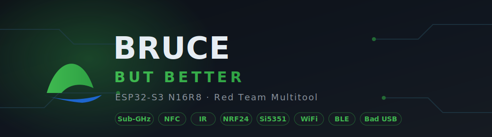

<div align="center">



# BRUCE DIY FLIPPER — ESP32-S3 N16R8

**Downstream build of the [Bruce](https://github.com/pr3y/Bruce) firmware for a hand-built ESP32-S3 multitool.**

Sub-GHz · NFC/RFID · IR · WiFi/BLE · NRF24 · Si5351 signal generator — one device, one binary.

<br>

[](https://github.com/pr3y/Bruce)
[](https://www.espressif.com/en/products/socs/esp32-s3)
[](https://platformio.org/)
[](./LICENSE)

[](https://github.com/modabucksmain-pixel/Bruce-DIY-Flipper/stargazers)
[](https://github.com/modabucksmain-pixel/Bruce-DIY-Flipper/network/members)
[](https://github.com/modabucksmain-pixel/Bruce-DIY-Flipper/issues)
[](https://github.com/modabucksmain-pixel/Bruce-DIY-Flipper/commits)

**[ WEB FLASHER ](https://modabucksmain-pixel.github.io/Bruce-DIY-Flipper/)** ·
**[ RELEASES ](https://github.com/modabucksmain-pixel/Bruce-DIY-Flipper/releases)** ·
**[ CONTRIBUTE ](./CONTRIBUTING.md)** ·
**[ REPORT A BUG ](https://github.com/modabucksmain-pixel/Bruce-DIY-Flipper/issues/new/choose)**

</div>

```
   ESP32-S3 N16R8  ·  16 MB Flash  ·  8 MB PSRAM  ·  Dual USB-C  ·  Runtime-probed modules
```

---

A hand-built Flipper Zero on the ESP32-S3 N16R8. This repository is a downstream fork of the
[Bruce](https://github.com/pr3y/Bruce) firmware, adapted to custom hardware: shared SPI/I²C backbone,
dual USB-C, and an added Si5351 signal-generator module. One binary covers every populated chip.

> **Legal notice** — For **authorized** security testing and education only. Distributed under AGPL.
> Unauthorized or malicious use is prohibited. You assume all responsibility.

---

## DOWNLOAD / FLASH

### Browser flasher (recommended)

**[modabucksmain-pixel.github.io/Bruce-DIY-Flipper](https://modabucksmain-pixel.github.io/Bruce-DIY-Flipper/)**

Open in desktop Chrome/Edge, connect via the **left USB-C** (UART), click **Flash**. No toolchain needed.

### Manual

Latest builds: **[Releases](https://github.com/modabucksmain-pixel/Bruce-DIY-Flipper/releases/tag/v1.0.0)**

Single file (merged — bootloader + partitions + boot_app0 + firmware, offset `0x0`):

```sh
esptool.py --chip esp32s3 --port COMx write_flash 0x0 Bruce-esp32-s3-N16R8.bin
```

Separate components:

```sh
esptool.py --chip esp32s3 --port COMx write_flash \
  0x0      bootloader.bin \
  0x8000   partitions.bin \
  0xe000   boot_app0.bin \
  0x10000  firmware.bin
```

> Linux/Mac: use `/dev/ttyACM0` or `/dev/ttyUSB0` instead of `COMx`. Flash over the **left USB-C** (UART) port.

| File | Offset | Purpose |
|---|---|---|
| `Bruce-esp32-s3-N16R8.bin` | `0x0` | Merged (all-in-one) |
| `bootloader.bin` | `0x0` | Bootloader |
| `partitions.bin` | `0x8000` | Partition table |
| `boot_app0.bin` | `0xe000` | OTA selector |
| `firmware.bin` | `0x10000` | Application |

---

## HARDWARE

### Main board

- **ESP32-S3 N16R8** — 16 MB QSPI Flash, 8 MB OPI PSRAM
- Dual USB-C: **Left** = UART/programming, **Right** = Native USB (Bad USB / HID)

### Modules

| Module | Function |
|---|---|
| CC1101 | Sub-GHz 300–928 MHz |
| PN532 | NFC 13.56 MHz + RFID |
| NRF24L01 ×2 | 2.4 GHz · MouseJack · jammer |
| Si5351 | Signal generator 8 kHz–160 MHz |
| MicroSD | File storage |
| OLED 1.3" SH1106 (SSD1106G) | Display |
| VS1838B | IR receiver 38 kHz |
| IR LED + 2N2222 | IR transmitter |
| Passive buzzer | Sound |
| 6× buttons | Navigation |

---

## PINOUT

I²C (shared) — OLED `0x3C`, PN532 `0x24`, Si5351 `0x60`:

```
IO8  = SDA
IO18 = SCL
```

SPI (shared bus) — CC1101 + MicroSD + NRF24 ×2:

```
IO11 = MOSI
IO12 = SCK
IO13 = MISO
```

CS / control pins (unique, no conflict):

```
CC1101    GDO0=IO9   CS=IO10
MicroSD   CS=IO14
NRF24 #1  CE=IO4     CSN=IO5
NRF24 #2  CE=IO6     CSN=IO7
IR        RX=IO1     TX=IO2
Buzzer    IO47
```

Buttons (to GND, pull-up):

```
UP=IO15  DOWN=IO16  LEFT=IO38  RIGHT=IO39  OK=IO40  BACK=IO41
```

**RESERVED — do not use (bricks the board):**

```
GPIO 26-32  -> QSPI Flash
GPIO 33-37  -> OPI PSRAM (forbidden on N16R8)
GPIO 19-20  -> Native USB D+/D- (reserved for Bad USB)
GPIO 45-46  -> Strapping
GPIO 43-44  -> UART0 TX/RX (debug)
```

---

## BUILD FROM SOURCE

Requires [PlatformIO](https://platformio.org/).

```sh
# Build
pio run -e esp32-s3-devkitc-1-psram

# Build + upload
pio run -e esp32-s3-devkitc-1-psram -t upload

# Serial monitor
pio device monitor
```

Output: `.pio/build/esp32-s3-devkitc-1-psram/firmware.bin`. Active board set by `default_envs` in `platformio.ini`.

> **One binary, mixed hardware** — modules are probed at runtime. A missing chip shows a "not found"
> message and returns to the menu instead of crashing. Flash the same binary regardless of which
> optional modules are populated.

---

## CAPABILITIES

Nine attack/utility modules. Quick map, then the detail:

| Domain | Contents |
|---|---|
| **WiFi** | AP/scan, Beacon spam, Deauth, Evil Portal, Wardriving, Sniffer, ARP spoof/poison, Responder |
| **BLE** | Scan, Bad BLE (Ducky), iOS/Windows/Samsung/Android spam |
| **Sub-GHz (CC1101)** | Scan/Copy, Custom SubGhz, Spectrum, Replay, Jammer |
| **NFC/RFID (PN532)** | Read/Clone/Write, NDEF, Chameleon, Amiibolink |
| **IR** | TV-B-Gone, Receiver, Custom IR (NEC, SIRC, RC5/6, Samsung32) |
| **NRF24** | Jammer, 2.4G Spectrum, Mousejack |
| **Si5351** | Frequency generation 8 kHz–160 MHz (CLK0/1/2), sweep, AM band |
| **Bad USB** | Ducky scripts (right USB-C / Native USB) |
| **Other** | JS interpreter, WebUI, SD/LittleFS manager, QR, iButton |

### WiFi

- **Deauth** — disconnect clients from a target AP (802.11 deauth frames).
- **Beacon spam** — flood the air with fake SSIDs.
- **Evil Portal** — captive-portal credential harvesting.
- **Sniffer** — capture raw 802.11 / probe-request traffic.
- **Wardriving** — log nearby APs with GPS (if attached).
- **ARP spoof/poison + Responder** — LAN man-in-the-middle, DHCP starvation.
- **AP / scan** — host an access point or enumerate networks.

### BLE

- **Spam** — flood iOS, Windows, Samsung, Android with pairing pop-ups.
- **Bad BLE** — wireless Ducky / HID keystroke injection over Bluetooth.
- **Scan** — enumerate nearby BLE devices.

### Sub-GHz (CC1101, 300–928 MHz)

- **Jammer** — flood a Sub-GHz band (garage doors, remotes, 433 MHz gear).
- **Scan / Copy + Replay** — capture a remote's signal and re-transmit it.
- **Custom SubGhz** — transmit arbitrary frequency / modulation.
- **Spectrum** — live Sub-GHz analyzer.

### NFC / RFID (PN532, 13.56 MHz)

- **Read / Clone / Write** — dump cards and copy to blanks.
- **NDEF** — read/write NFC data records.
- **Chameleon + Amiibolink** — card emulation.

### Infrared

- **Jammer** — flood IR receivers with noise.
- **TV-B-Gone** — power off most TVs with one button.
- **Receiver** — decode and save remote signals.
- **Custom IR** — transmit NEC, SIRC, RC5/6, Samsung32 and more.

### NRF24 (2.4 GHz, ×2)

- **Jammer** — flood the 2.4 GHz band (WiFi/BLE/devices in range).
- **Mousejack** — inject keystrokes into vulnerable wireless mice/keyboards.
- **2.4G Spectrum** — live 2.4 GHz analyzer.

### Si5351 signal generator

- **Frequency gen** — clean output 8 kHz–160 MHz on CLK0 / CLK1 / CLK2.
- **Sweep** — scan across a frequency range.
- **AM band** — generate AM-radio carriers.

### Bad USB

- **Ducky scripts** — keystroke injection over native USB (right USB-C / HID).

### Extras

- JavaScript interpreter, WebUI control panel, SD / LittleFS file manager, QR codes, iButton.

> **Operational warning** — jammers and deauth are illegal to operate against equipment you do not own
> in most jurisdictions (RF-interference / unauthorized-access laws). Use only on your own hardware in a
> controlled environment, or where you hold written authorization.

---

## CONTRIBUTING

Bug fixes, new modules, board ports, docs — all welcome. Full guide: **[CONTRIBUTING.md](./CONTRIBUTING.md)**.

1. Fork, branch: `git checkout -b feature/my-change`
2. Confirm it compiles: `pio run -e esp32-s3-devkitc-1-psram`
3. Format C/C++ with `clang-format` (config in `.clang-format`)
4. Commit, push, open a Pull Request
5. Bug or idea? [Open an issue](https://github.com/modabucksmain-pixel/Bruce-DIY-Flipper/issues/new/choose)

Adding hardware? Pin maps live in `boards/ESP-General/pins_arduino.h`; a new module goes under
`src/modules/<name>/` with its menu in `src/core/menu_items/`.

---

## CREDITS

Downstream fork of the [**Bruce**](https://github.com/pr3y/Bruce) firmware. All upstream credit to
[@pr3y](https://github.com/pr3y), [@bmorcelli](https://github.com/bmorcelli), and the Bruce contributors.
Improvements made here are intended to flow back upstream where useful.

- Upstream: https://github.com/pr3y/Bruce
- Project site: https://bruce.computer
- Wiki: https://wiki.bruce.computer
- Discord: https://discord.gg/WJ9XF9czVT

## LICENSE

AGPL — see [LICENSE](./LICENSE).
